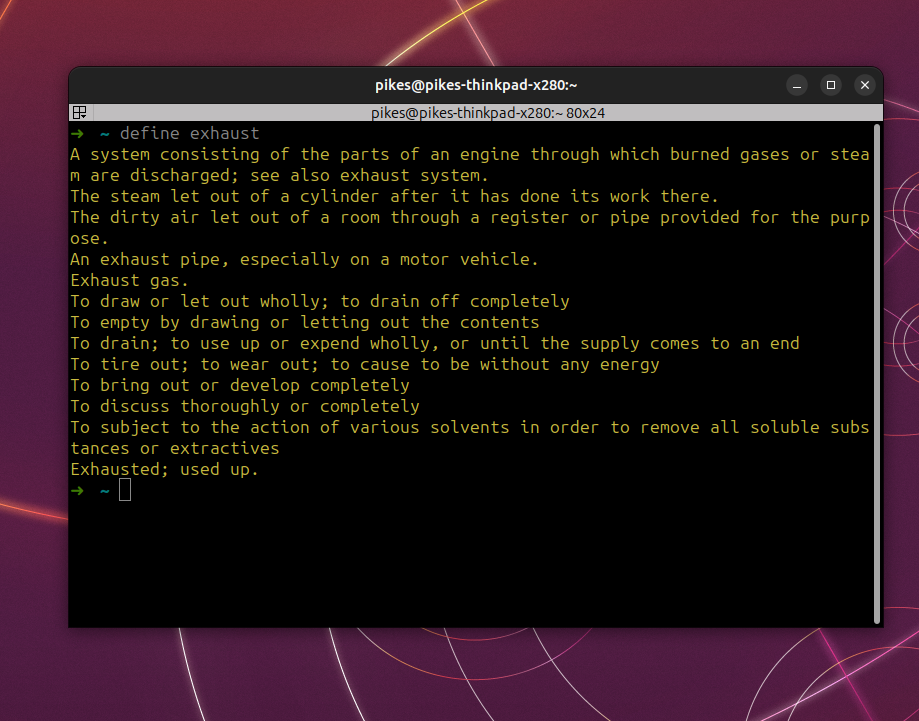

# Define

- defne is command line tool.
- it can be used to define meaning of the word while staying in the terminal.

## How to run?

``` bash 
    define {YOUR WORD}
```
### it is simple and easy to use. i made it keep myself in the zone stop myself from wondering the web.

